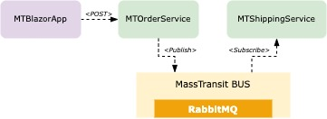

# MassTransit Demo

The following repository contain a demo application I wrote to start playing with Mass Transit and microservices in .NET environment. The idea was to learn extra knowledge and try out different products for building modern scalable distributed systems.
What I wanted to achieve is as follow:
- Build a demo Pub/Sub application with MassTransit and gain knowledge
- Implement a free/open-source platform for distributed logging
- Implement a free/open-source platform for distributed tracing
- Implement a free/open-source platform for distributed monitoring

## Platforms

This repository make use of the following platforms:

| Platform | Link |
| ------ | ------ |
| .NET 6 | [External-Link][Net6] |
| MassTransit | [External-Link][MT] |
| Serilog | [External-Link][Serilog] |
| Prometheus | [External-Link][Prometheus] |
| Seq | [External-Link][Seq] |
| Jaeger | [External-Link][Jaeger] |
| Grafana | [External-Link][Grafana] |
| Docker | [External-Link][Docker] |

## Architecture



## How to Run

Make sure you have Docker installed on your machine, then clone this repository and run the infrastructure stript:

```sh
cd infrastructure
./run.sh
```
This will run the docker compose file to create all the containers needed for this demo. Containers will be created under the project name 'mtdemo'.

Open Visual Studio or Visual Studio Code and build/run the following projects:

- MTBlazorApp -> Blazor WASM project used to generate orders
- MTOrderService -> WebAPI project used to receive incoming orders and forward to shipping service
- MTShippingService -> Service Worker listening for incoming orders on the messaging bus

## User Intefaces

When all the docker containers are up and running the following dashboards are available for you to play around:

| Application | Description | Link |
| ------ | ------ | ------ |
| MTBlazorApp | Used to generate orders | http://localhost:7000 |
| MTOrderService | Swagger API Interface | http://localhost:7100/swagger |
| Seq | Distributed logging | http://localhost:80 |
| RabbitMQ | Broker management interface | http://localhost:15672 |
| Prometheus | Prometheus management interface | http://localhost:9090 |
| Jaeger | Distributed tracing | http://localhost:16686 |
| Grafana(*) | Custom pre-loaded dashboards | http://localhost:3000 |

(*) For Grafana first login with default username and password: admin - admin

[//]: # (Links)
   [Net6]: <https://dotnet.microsoft.com/en-us/download/dotnet/6.0>
   [MT]: <https://masstransit-project.com/>
   [Serilog]: <https://serilog.net>
   [Prometheus]: <https://prometheus.io>
   [Seq]: <https://datalust.co/seq>
   [Grafana]: <https://grafana.com>
   [Docker]: <https://www.docker.com>
   [Jaeger]: <https://www.jaegertracing.io>
